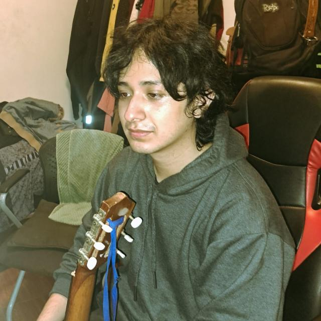
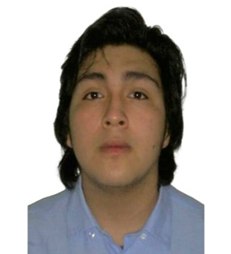
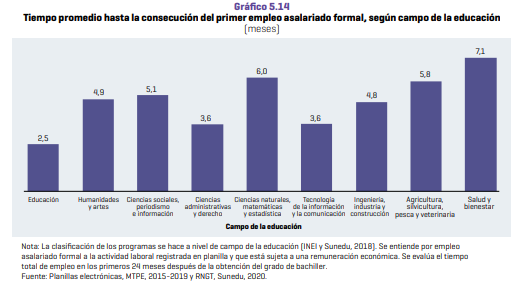
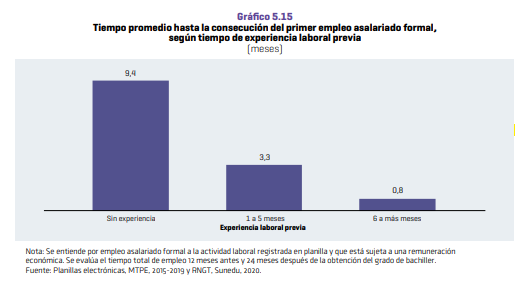

**Universidad Peruana de Ciencias Aplicadas**

**Carrera**: Ingeniería de Software

**Ciclo**: 2024-02

**Curso**: Desarrollo de Aplicaciones Open Source

**Sección**: SW54

**Profesor**: Alberto Wilmer Sanchez Seña

**Informe de Trabajo Final**

**Startup**: Law Connect S.A.C.

**Producto**: Law Connect

**Integrantes**:

- Avellaneda Ramos, Carlos Edward - U201923994
- La Madrid Lozano, Ivan Jeanpierre - U202118946
- Condori Lozano, Alessandro Ramiro -
- Loli Ramirez, Camila Cristina - U202110385
- Pariona Lucas, Jose Manuel - U202119257

**Agosto del 2024**

---
# Registro de Versiones del Informe

---
# Project Report Collaboration Insights

---
# Student Outcome
El curso contribuye al cumplimiento del Student Outcome ABET: **ABET – EAC - Student Outcome 3**   Criterio: *Capacidad de comunicarse efectivamente con un rango de audiencias.*

En el siguiente cuadro se describe las acciones realizadas y enunciados de conclusiones por parte del grupo, que permiten sustentar el haber alcanzado el logro del ABET – EAC - Student Outcome 3.

| Criterio específico                                                                                                                                                                   | Acciones realizadas                                                                                                                                                                                                                                                                                                                                                                                                                                                                                                                                                                                                                                                                                                                                                                                                                                                                                                                                                                                                                                                                                                                                           | Conclusiones                                                                                                                                                                                                                                                                                                                                                                         |
|---------------------------------------------------------------------------------------------------------------------------------------------------------------------------------------|---------------------------------------------------------------------------------------------------------------------------------------------------------------------------------------------------------------------------------------------------------------------------------------------------------------------------------------------------------------------------------------------------------------------------------------------------------------------------------------------------------------------------------------------------------------------------------------------------------------------------------------------------------------------------------------------------------------------------------------------------------------------------------------------------------------------------------------------------------------------------------------------------------------------------------------------------------------------------------------------------------------------------------------------------------------------------------------------------------------------------------------------------------------|--------------------------------------------------------------------------------------------------------------------------------------------------------------------------------------------------------------------------------------------------------------------------------------------------------------------------------------------------------------------------------------|
| Comunica oralmente sus ideas y/o resultados con objetividad a público de diferentes especialidades y niveles jerarquicos, en el marco del desarrollo de un proyecto en ingeniería.    | **Apellido Apellido Nombre Nombre**   ***TB1:*** Morbi vel tortor id eros dictum venenatis id ut dui.Mauris quis tellus sed nunc hendrerit vehicula ac id mauris.   ***TP:*** Morbi vel tortor id eros dictum venenatis id ut dui.Mauris quis tellus sed nunc hendrerit vehicula ac id mauris.   ***TB2:*** Morbi vel tortor id eros dictum venenatis id ut dui.Mauris quis tellus sed nunc hendrerit vehicula ac id mauris.   ***TF:*** Morbi vel tortor id eros dictum venenatis id ut dui.Mauris quis tellus sed nunc hendrerit vehicula ac id mauris.    **Apellido Apellido Nombre Nombre**   ***TB1:*** Morbi vel tortor id eros dictum venenatis id ut dui.Mauris quis tellus sed nunc hendrerit vehicula ac id mauris.   ***TP:*** Morbi vel tortor id eros dictum venenatis id ut dui.Mauris quis tellus sed nunc hendrerit vehicula ac id mauris.   ***TB2:*** Morbi vel tortor id eros dictum venenatis id ut dui.Mauris quis tellus sed nunc hendrerit vehicula ac id mauris.   ***TF:*** Morbi vel tortor id eros dictum venenatis id ut dui.Mauris quis tellus sed nunc hendrerit vehicula ac id mauris.    | ***TB1:*** Fusce cursus dolor et nulla suscipit, sit amet ullamcorper nibh vestibulum.    ***TP:*** Fusce cursus dolor et nulla suscipit, sit amet ullamcorper nibh vestibulum.    ***TB2:*** Fusce cursus dolor et nulla suscipit, sit amet ullamcorper nibh vestibulum.    ***TF:*** Fusce cursus dolor et nulla suscipit, sit amet ullamcorper nibh vestibulum. | 
| Comunica en forma escrita ideas y/o resultados con objetividad a público de diferentes especialidades y niveles jerarquicos, en el marco del desarrollo de un proyecto en ingeniería. | ***Apellido Apellido Nombre Nombre***   ***TB1:*** Cras sed diam suscipit, malesuada ex rutrum, fringilla orci. Vestibulum in nunc quis elit suscipit sollicitudin.   ***TP:*** Cras sed diam suscipit, malesuada ex rutrum, fringilla orci. Vestibulum in nunc quis elit suscipit sollicitudin.   ***TB2:*** Cras sed diam suscipit, malesuada ex rutrum, fringilla orci. Vestibulum in nunc quis elit suscipit sollicitudin.   ***TF:*** Cras sed diam suscipit, malesuada ex rutrum, fringilla orci. Vestibulum in nunc quis elit suscipit sollicitudin.    ***Apellido Apellido Nombre Nombre***   ***TB1:*** Cras sed diam suscipit, malesuada ex rutrum, fringilla orci. Vestibulum in nunc quis elit suscipit sollicitudin.   ***TP:*** Cras sed diam suscipit, malesuada ex rutrum, fringilla orci. Vestibulum in nunc quis elit suscipit sollicitudin.   ***TB2:*** Cras sed diam suscipit, malesuada ex rutrum, fringilla orci. Vestibulum in nunc quis elit suscipit sollicitudin.   ***TF:*** Cras sed diam suscipit, malesuada ex rutrum, fringilla orci. Vestibulum in nunc quis elit suscipit sollicitudin.      | ***TB1:*** FEtiam imperdiet quam condimentum velit tempor porttitor.    ***TP:*** FEtiam imperdiet quam condimentum velit tempor porttitor.    ***TB2:*** FEtiam imperdiet quam condimentum velit tempor porttitor.    ***TF:*** FEtiam imperdiet quam condimentum velit tempor porttitor.                                                                         |

---
# Contenido
## Tabla de contenidos

### [Capítulo I: Introducción]()
- [1.1. Startup Profile]()
    - [1.1.1 Descripción de la Startup]()
    - [1.1.2 Perfiles de integrantes del equipo]()
- [1.2 Solution Profile]()
    - [1.2.1 Antecedentes y problemática]()
    - [1.2.2 Lean UX Process]()
        - [1.2.2.1. Lean UX Problem Statements]()
        - [1.2.2.2. Lean UX Assumptions]()
        - [1.2.2.3. Lean UX Hypothesis Statements]()
        - [1.2.2.4. Lean UX Canvas]()
- [1.3. Segmentos objetivo]()

### [Capítulo II: Requirements Elicitation & Analysis]()
- [2.1. Competidores]()
    - [2.1.1. Análisis competitivo]()
    - [2.1.2. Estrategias y tácticas frente a competidores]()
- [2.2. Entrevistas]()
    - [2.2.1. Diseño de entrevistas]()
    - [2.2.2. Registro de entrevistas]()
    - [2.2.3. Análisis de entrevistas]()
- [2.3. Needfinding]()
    - [2.3.1. User Personas]()
    - [2.3.2. User Task Matrix]()
    - [2.3.3. User Journey Mapping]()
    - [2.3.4. Empathy Mapping]()
    - [2.3.5. As-is Scenario Mapping]()
- [2.4. Ubiquitous Language]()

### [Capítulo III: Requirements Specification]()
- [3.1. To-Be Scenario Mapping]()
- [3.2. User Stories]()
- [3.3. Impact Mapping]()
- [3.4. Product Backlog]()

### [Capítulo IV: Product Design]()
- [4.1. Style Guidelines]()
    - [4.1.1. General Style Guidelines]()
    - [4.1.2. Web Style Guidelines]()
- [4.2. Information Architecture]()
    - [4.2.1. Organization Systems]()
    - [4.2.2. Labeling Systems]()
    - [4.2.3. SEO Tags and Meta Tags]()
    - [4.2.4. Searching Systems]()
    - [4.2.5. Navigation Systems]()
- [4.3. Landing Page UI Design]()
    - [4.3.1. Landing Page Wireframe]()
    - [4.3.2. Landing Page Mock-up]()
- [4.4. Web Applications UX/UI Design]()
    - [4.4.1. Web Applications Wireframes]()
    - [4.4.2. Web Applications Wireflow Diagrams]()
    - [4.4.3. Web Applications Mock-ups]()
    - [4.4.4. Web Applications User Flow Diagrams]()
- [4.5. Web Applications Prototyping]()
- [4.6. Domain-Driven Software Architecture]()
    - [4.6.1. Software Architecture Context Diagram]()
    - [4.6.2. Software Architecture Container Diagrams]()
    - [4.6.3. Software Architecture Components Diagrams]()
- [4.7. Software Object-Oriented Design]()
    - [4.7.1. Class Diagrams]()
    - [4.7.2. Class Dictionary]()
- [4.8. Database Design]()
    - [4.8.1. Database Diagram]()

### [Capítulo V: Product Implementation, Validation & Deployment]()
- [5.1. Software Configuration Management]()
    - [5.1.1. Software Development Environment Configuration]()
    - [5.1.2. Source Code Management]()
    - [5.1.3. Source Code Style Guide & Conventions]()
    - [5.1.4. Software Deployment Configuration]()
- [5.2. Landing Page, Services & Applications Implementation]()
    - [5.2.1. Sprint 1]()
        - [5.2.1.1. Sprint Planning 1]()
        - [5.2.1.2. Sprint Backlog 1]()
        - [5.2.1.3. Development Evidence for Sprint Review]()
        - [5.2.1.4. Testing Suite Evidence for Sprint Review]()
        - [5.2.1.5. Execution Evidence for Sprint Review]()
        - [5.2.1.6. Services Documentation Evidence for Sprint Review]()
        - [5.2.1.7. Software Deployment Evidence for Sprint Review]()
        - [5.2.1.8. Team Collaboration Insights during Sprint]()
    - [5.2.2. Sprint 2]()
        - [5.2.2.1. Sprint Planning 2]()
        - [5.2.2.2. Sprint Backlog 2]()
        - [5.2.2.3. Development Evidence for Sprint Review]()
        - [5.2.2.4. Testing Suite Evidence for Sprint Review]()
        - [5.2.2.5. Execution Evidence for Sprint Review]()
        - [5.2.2.6. Services Documentation Evidence for Sprint Review]()
        - [5.2.2.7. Software Deployment Evidence for Sprint Review]()
        - [5.2.2.8. Team Collaboration Insights during Sprint]()
    - [5.2.3. Sprint 3]()
        - [5.2.3.1. Sprint Planning 3]()
        - [5.2.3.2. Sprint Backlog 3]()
        - [5.2.3.3. Development Evidence for Sprint Review]()
        - [5.2.3.4. Testing Suite Evidence for Sprint Review]()
        - [5.2.3.5. Execution Evidence for Sprint Review]()
        - [5.2.3.6. Services Documentation Evidence for Sprint Review]()
        - [5.2.3.7. Software Deployment Evidence for Sprint Review]()
        - [5.2.3.8. Team Collaboration Insights during Sprint]()
    - [5.2.4. Sprint 4]()
        - [5.2.4.1. Sprint Planning 4]()
        - [5.2.4.2. Sprint Backlog 4]()
        - [5.2.4.3. Development Evidence for Sprint Review]()
        - [5.2.4.4. Testing Suite Evidence for Sprint Review]()
        - [5.2.4.5. Execution Evidence for Sprint Review]()
        - [5.2.4.6. Services Documentation Evidence for Sprint Review]()
        - [5.2.4.7. Software Deployment Evidence for Sprint Review]()
        - [5.2.4.8. Team Collaboration Insights during Sprint]()
- [5.3. Validation Interviews]()
    - [5.3.1. Diseño de Entrevistas]()
    - [5.3.2. Registro de Entrevistas]()
    - [5.3.3. Evaluaciones según heurísticas]()
- [5.4. Video About-the-Product]()

---
# Capítulo I: Introducción
## 1.1. Startup Profile
### 1.1.1 Descripción de la Startup
Law Connect S.A.C. es una startup conformada por un grupo de estudiantes de la carrera de Ingeniería de Software de la Universidad Peruana de Ciencias Aplicadas (UPC). Esta nueva empresa está enfocada en la creación de herramientas tecnológicas para el rubro de abogacía. Mediante las aplicaciones que creamos, esperamos optimizar los procesos legales que los clientes puedan tener actualmente. Asimismo, estas aplicaciones son para los abogados también, sin excluir en términos de rango de edades o experiencia laboral; de esta forma, permitimos que haya más oportunidades laborales. Es por ello que, como nuestro primer proyecto, vamos a desarrollar la aplicación Law Connect. Esta es una aplicación web con la cual buscamos facilitar la búsqueda de abogados calificados para personas que cuenten con problemas legales. Además, esperamos generar más ofertas laborales a los abogados recién egresados de la universidad, lo cual posibilita que consigan oportunidades de trabajo, para obtener más experiencia. Así, mejoramos la comunicación entre los egresados y potenciales clientes, por lo tanto, cumplimos con nuestra misión.

**Misión**: Brindar una comunicación eficiente entre abogados calificados y clientes, para optimizar los procesos legales y promover el uso de herramientas tecnológicas en el rubro. El motivo es incrementar las ofertas laborales y que los clientes tengan la oportunidad de encontrar un abogado que se acomode a sus necesidades.
**Visión**: Liderar en el rubro de leyes con nuestra startup al brindar nuevas opciones sostenibles y digitales, esperamos crear un puente entre los clientes y abogados con las aplicaciones que ofrecemos. Law Connect S.A.C. desea reinventar el rubro de leyes al permitir el incremento del uso de la tecnología en distintos procesos legales.
### 1.1.2 Perfiles de integrantes del equipo

|                             **U201923994**                             |                                                                                                                                                                                                                                                                                             Avellaneda Ramos, Carlos Edward                                                                                                                                                                                                                                                                                             |
|:----------------------------------------------------------------------:|:-----------------------------------------------------------------------------------------------------------------------------------------------------------------------------------------------------------------------------------------------------------------------------------------------------------------------------------------------------------------------------------------------------------------------------------------------------------------------------------------------------------------------------------------------------------------------------------------------------------------------:|
| **** |                                                                                                          *Ingeniería de Software*  Soy una persona amigable, me gusta hacer creación de contenido, y también me agrada el trabajo en equipo. Tengo experiencia en Frontend y Backend, he realizado proyectos para empresas pequeñas. Me especializo en la programación y tengo conocimientos en la creación de páginas web y videojuegos. Además de usar herramientas para edición de imágenes o videos.                                                                                                          |
|                             **U202118946**                             |                                                                                                                                                                                                                                                                                          **La Madrid Lozano, Ivan Jeanpierre**                                                                                                                                                                                                                                                                                          |
|               |                                                                                                                              *Ingeniería de Software*  Tengo 20 años. En estos momentos me encuentro estudiando la carrera de Ing. de Software en la Universidad Peruana de Ciencias Aplicadas. Cuento con conocimientos intermedios de programación y básicos en desarrollo web. Dicho esto, considero que soy una persona responsable que está en disposición de aportar al grupo.                                                                                                                              |
|                             **U20211A118**                             |                                                                                                                                                                                                                                                                                          **Condori Lozano, Alessandro Ramiro**                                                                                                                                                                                                                                                                                          |
| **** |                                                                                                                        *Ingeniería de Software*  Tengo 21 años, actualmente me encuentro matriculado en la carrera de Ingeniería de Software en la Universidad Peruana de Ciencias Aplicadas. Poseo un nivel intermedio de habilidades en programación, con conocimientos adicionales en desarrollo web. Me considero una persona competitiva, responsable y que sabe trabajar en equipo.                                                                                                                         |
|                             **U202110385**                             |                                                                                                                                                                                                                                                                                            **Loli Ramirez, Camila Cristina**                                                                                                                                                                                                                                                                                            |
|        ****        |                         *Ingeniería de Software*  Soy Camila Cristina Loli Ramirez, tengo 20 años y soy alumna de la carrera Ingeniería de Software. Mi carrera se basa en los conocimientos y técnicas científicas para crear un programa informático. Tengo experiencia con el trabajo en equipo, creación de proyectos y creación de programas básicos. Aportaré al equipo mi creatividad, compromiso de trabajo en equipo, puntualidad y responsabilidad. Me comprometo a trabajar constantemente para mejorar nuestro proyecto y a generar un entorno de trabajo sano con mi grupo.                          |
|                             **U202119257**                             |                                                                                                                                                                                                                                                                                             **Pariona Lucas, Jose Manuel**                                                                                                                                                                                                                                                                                              |
|       ****       | *Ingeniería de Software*  Tengo 18 años. En la actualidad estoy estudiando la carrera de Ingeniería de Software en la Universidad Peruana de Ciencias Aplicadas. Cuento con conocimientos intermedios y avanzados en algunos lenguajes de programación. HTML, CSS, JAVASCRIPT (Avanzado) C++, JAVA, PYTHON (Intermedio) Esto con respecto a la programación, además también de conocimientos con desarrollo web y desarrollo de apps. Me considero una persona responsable, que inspira confianza en el trabajo en grupo. Además, soy bastante adaptativo a la presión y los problemas que pueden llegar a pasar. |

## 1.2 Solution Profile
### 1.2.1 Antecedentes y problemática
Según Vallecilla (2024), hasta febrero del año 2024, la tasa de desempleo en Perú alcanzó el 7.30%. Esta realidad no es ajena para los egresados de la carrera de derecho, los cuales se enfrentan a desafíos para encontrar un empleo estable debido a la coyuntura actual. Acorde al Tercer Informe Bienal sobre la Realidad Universitaria en el Perú de Sunedu (2022), se explica que a los bachilleres de leyes les demora 3,6 meses en conseguir un trabajo, lo cual impide que tengan continuidad para ejercer su carrera luego de su graduación. Asimismo, todavía hay un porcentaje de estudiantes (6.4%) en Lima que les puede tomar dese 17 a 23 meses; es por ello que deseamos disminuir esa cantidad, debido a que implica un impacto en su currículum, esto complica aún más sus oportunidades laborales. Por otro lado, también existe la dificultad para aquellas personas con problemas legales de encontrar un abogado calificado, ya que carecen de orientación sobre dónde buscar o cómo encontrarlos.

Para realizar los antecedentes y problemáticas, se realizó con anticipación la técnica 5 ‘W’s & 2 ‘H’s:

**What**: El problema es el desempleo entre los egresados de la carrera de derecho y la dificultad de las personas con problemas legales al momento de buscar abogados calificados para sus casos.
**When**: El problema sucede desde hacer varios años atrás, según Segundo Informe Bienal sobre la Realidad Universitaria en el Perú de Sunedu (2020), que considera un análisis del año 2012 a 2018, había una tasa de desempleo en universitarios de 8,8%, un nivel bastante alto a pesar de tener grado de bachiller.
**Where**: Este análisis se enfoca en Lima, en este se enfrentan distintos desafíos al momento de encontrar un empleo al ser un estudiante egresado de la carrera de leyes. Asimismo, hay un grado de dificultad para acceder a los servicios legales debido a la falta de información al momento de contactar a un abogado.
**Who**: Nos enfocamos en los egresados de la carrera de derecho que estén en búsqueda de empleo y en las personas que necesitan asistencia legal para sus respectivos casos.
**Why**: La oferta laboral para los abogados es más alta que la demanda de trabajo, es por ello que nos enfocamos explícitamente en los egresados, porque es más difícil hallar trabajo en un rubro tan sobrepoblado. Buscamos mitigar el desempleo en el rubro de leyes.
**How**: Desarrollaremos Law Connect para facilitar la búsqueda de abogados y aumentar la demanda laboral para los abogados. Asimismo, brindaremos la aplicación web a los clientes para mejorar la comunicación con abogados calificados.
**How much**:
*Estadística de la problemática*

Según el Tercer Informe Bienal sobre la Realidad Universitaria en el Perú hecho por Sunedu (2022) para analizar el estado de los estudiantes universitarios - incluye de todo tipo de instituciones, sea privada o pública y a los de otros departamentos en el país - antes, durante y después de su formación superior académica, se pueden analizar dos gráficos estadísticos que explican la gravedad de la situación de los egresados.

Del primer gráfico analizamos la cantidad de meses que demora a un egresado de la carrera de derecho, les toma 3,6 meses a partir de la obtención de su grado. A pesar de que no es un número tan alto como en las situaciones de las demás carreras, aun así es un tiempo preocupante debido a que varios estudiantes tienden a pagar su propia carrera, encontrando otro tipo de trabajos. Asimismo, en la página X del resumen ejecutivo, se señala que la tasa de desempleo de los egresados aumentó de 6.8% a 15.5% a nivel nacional, lo cual refuerza las complicaciones que tienen para encontrar un empleo formal.

*Estadística sobre el tiempo promedio que toma a un estudiante egresado lograr su primer empleo asalariado formal según su carrera. Fuente: Sunedu, 2022.*

En el segundo gráfico se muestra el tiempo que demora a los egresados encontrar trabajo luego de su graduación acorde a su experiencia laboral. A los egresados sin experiencia previa en el rubro les toma 9,4 meses encontrar un puesto para laborar; la cantidad de meses disminuye a medida que la cantidad de tiempo trabajado en prácticas pre profesionales es mayor. Al tener en cuenta estos números, se comprueba que hay más dificultad al momento de buscar trabajo sin experiencia previa.

****
*Estadística sobre el tiempo promedio que toma a un estudiante egresado lograr su primer empleo asalariado formal según su carrera acorde a su experiencia laboral durante su carrera. Fuente: Sunedu 2022.*
### 1.2.2 Lean UX Process

#### 1.2.2.1. Lean UX Problem Statements

#### 1.2.2.2. Lean UX Assumptions

#### 1.2.2.3. Lean UX Hypothesis Statements

#### 1.2.2.4. Lean UX Canvas

## 1.3. Segmentos objetivo

# Capítulo II: Requirements Elicitation & Analysis
## 2.1 Competidores
## 2.2. Entrevistas
### 2.2.1. Diseño de entrevistas
### 2.2.2. Registro de entrevistas
### 2.2.3. Análisis de entrevistas
## 2.3. Needfinding
### 2.3.1. User Personas
### 2.3.2. User Task Matrix
### 2.3.3. User Journey Mapping
### 2.3.4. Empathy Mapping
### 2.3.5. As-is Scenario Mapping
## 2.4. Ubiquitous Language
# Capítulo III: Requirements Specification
## 3.1. To-Be Scenario Mapping
## 3.2. User Stories
## 3.3. Impact Mapping
## 3.4. Product Backlog
# Capítulo IV: Product Design
## 4.1. Style Guidelines
## 4.2. Information Architecture
## 4.3. Landing Page UI Design
## 4.4. Web Applications UX/UI Design
### 4.4.1. Web Applications Wireframes
### 4.4.2. Web Applications Wireflow Diagrams
### 4.4.3. Web Applications Mock-ups
### 4.4.4. Web Applications User Flow Diagrams
## 4.5. Web Applications Prototyping
## 4.6. Domain-Driven Software Architecture
### 4.6.1. Software Architecture Context Diagram
### 4.6.2. Software Architecture Container Diagrams
### 4.6.3. Software Architecture Components Diagrams
## 4.7. Software Object-Oriented Design
### 4.7.1. Class Diagrams
### 4.7.2. Class Dictionary
## 4.8. Database Design
### 4.8.1. Database Diagram
# Capítulo V: Product Implementation, Validation & Deployment
## 5.1. Software Configuration Management
### 5.1.1. Software Development Environment Configuration

### 5.1.2. Source Code Management

### 5.1.3. Source Code Style Guide & Conventions

### 5.1.4. Software Deployment Configuration

## 5.2. Landing Page, Services & Applications Implementation
### 5.2.1. Sprint 1
#### 5.2.1.1. Sprint Planning 1

#### 5.2.1.2. Sprint Backlog 1

#### 5.2.1.3. Development Evidence for Sprint Review

#### 5.2.1.4. Testing Suite Evidence for Sprint Review

#### 5.2.1.5. Execution Evidence for Sprint Review

#### 5.2.1.6. Services Documentation Evidence for Sprint Review

#### 5.2.1.7. Software Deployment Evidence for Sprint Review

#### 5.2.1.8. Team Collaboration Insights during Sprint

# Conclusiones
### Conclusiones y recomendaciones
### Video About-the-Team

---
# Bibliografía

---
# Anexos